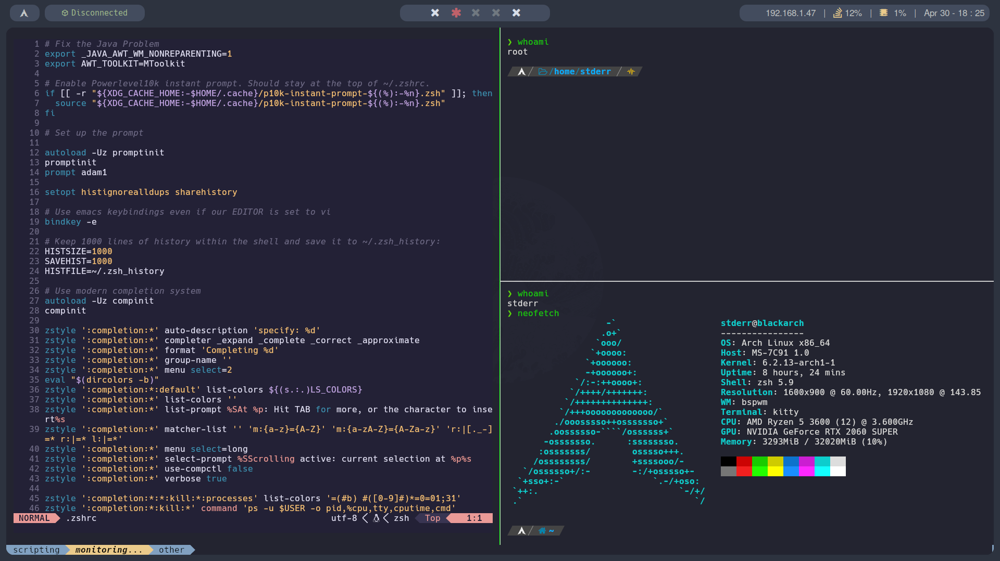

## Arch linux dotfiles




- WM: bspwm
- Menu: rofi
- Bar: polybar
- Terminal: kitty
- Text editor: nvim

## Automatic post install

Run the post install script:

```
curl -s https://raw.githubusercontent.com/nahuelrm/arch-dotfiles/main/scripts/post-install.sh | bash
```

## Arch linux installation guide
[docs/arch-install-commands.md](arch-install-commands.md)

## BINDS LIST

### bspwm binds (sxhkd)
	
`$HOME/.config/sxhkd/sxhkdrc`

| Action | Bind |
| :--- | :--- |
| Open terminal | `mod + enter` |
| Program launcher (rofi) | `mod + d` |
| Quit bspwm | `mod + alt + q` |
| Restart bspwm | `mod + alt + r` |
| Close and kill | `mod + w` |
| Alternate layout | `mod + m` |
| Screenshot | `mod + shift + s` |
| Open firefox | `mod + shift + f` |

### Kitty binds

| Action | Bind |
| :--- | :--- |
| New window | `ctrl + shift + enter` |
| Move neighbor window | `alt + arrows |
| Close window | `ctrl + shift + w` |
| Resize window | `ctrl + shift + r` |
| Change windows layout | `ctrl + shift + l` |
| Zoom up window | `ctrl + shift + z` |
| Open new tab | `ctrl + shift + t` |
| Rename new tab | `ctrl + shit + alt + t` |
| Move in tabs | `ctrl + shift + arrows` |
| Close tab | `ctrl + shift + w` |
| Move tabs | `ctrl + shift + {, or .}` |

### Fzf binds

| Action | Bind |
| :--- | :--- |
| List files and folders in current directory | `ctrl + t` |
| Reach history of shell commands | `ctrl + r` |

## Known Issues

- missing polybar, or terminal looking weird -> make sure hack nerd fonts are installed.
- if polybar doesnt show properly -> problems with the `monitor` option within the `config.ini` polybar config file.
- polybar invert number selection for workspaces -> modify sxhkd binds.
- rounded borders showing weird shapes -> change picom from `glx` to `xrender` or viceversa.

## TO-DO

- remake polybar config in a good way.
- add gnome config as well.
- make a batter hacking tools post install.

